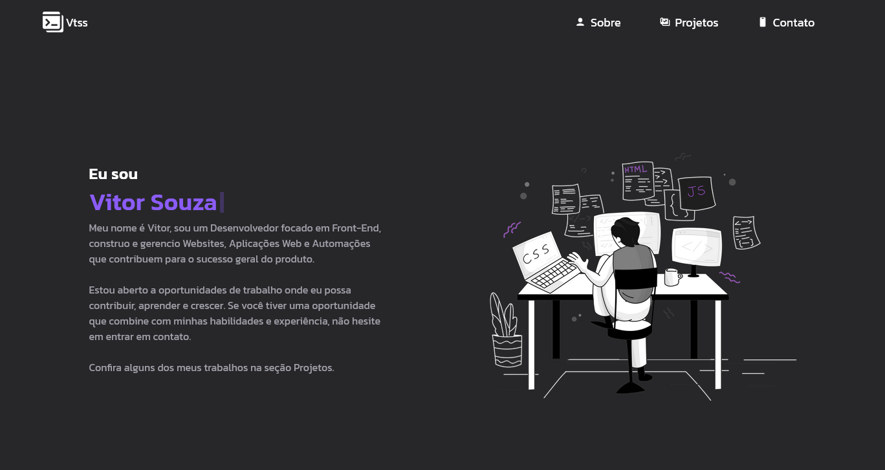

# Vtssweb

Este projeto é um portfólio web pessoal desenvolvido em React, com estilização utilizando Tailwind CSS, animações de digitação com o `react-simple-typewriter`, e um formulário de contato integrado com o serviço Email.js para o envio de mensagens.

[Acesse o aqui](https://vtssbr.github.io/Vtssweb/).



### Funcionalidades

* **Apresentação pessoal**: Exibe informações sobre suas habilidades, experiência e interesses.
* **Sessão de Projetos**: Mostra seus projetos com detalhes, como nome e descrição.
* **Formulário de Contato**: Permite que os visitantes entrem em contato diretamente, enviando mensagens que são processadas via Email.js.
* **Animações de Texto**: Utiliza o `react-simple-typewriter` para criar animações no cabeçalho da página, destacando palavras-chave.
* **Responsividade**: Interface adaptada para diferentes tamanhos de tela utilizando Tailwind CSS.

### Tecnologias

* **React**: Biblioteca JavaScript utilizada para a criação da interface do usuário.
* **Tailwind CSS**: Framework de CSS utilitário para estilização rápida e eficiente.
* **react-simple-typewriter**: Biblioteca usada para criar animações de digitação no texto.
* **Email.js**: Serviço de envio de e-mails diretamente do front-end, utilizado para o formulário de contato.
* **Vite**: Ferramenta para o build e desenvolvimento do projeto React.

### Configuração

Embora o site já esteja em deploy, você pode configurar e executar este projeto localmente, seguindo os passos abaixo:

1. Clone o repositório:

    ```bash
    git clone https://github.com/seu-usuario/seu-portifolio.git
    cd seu-portifolio
    ```

2. Instale as dependências:

    ```bash
    npm install
    ```

3. Execute o projeto localmente:

    ```bash
    npm run dev
    ```

### Deploy

O projeto está disponível em produção e pode ser acessado [aqui](https://vtssweb.onrender.com/) 
**Observação**: Como estou utilizando a versão gratuita do Render, o primeiro acesso pode demorar um pouco para carregar.

### Uso

Navegue pelo portfólio para visualizar informações pessoais, projetos realizados, e entre em contato através do formulário de contato. As mensagens enviadas são processadas diretamente pelo Email.js, que envia uma notificação para o e-mail configurado no serviço.

Este projeto demonstra o uso de tecnologias modernas de front-end para criar uma landing page pessoal profissional, com integração de serviços de terceiros como o Email.js para funcionalidades dinâmicas.
